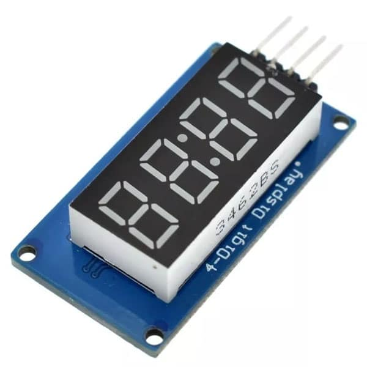

## Ejemplo módulo display TM1637

### El módulo se conecta por dos pines, uno de datos y otro de clk, que son manejados internamente por la librería sin necesidad de ningún periférico extra, solo DigitalOut.

